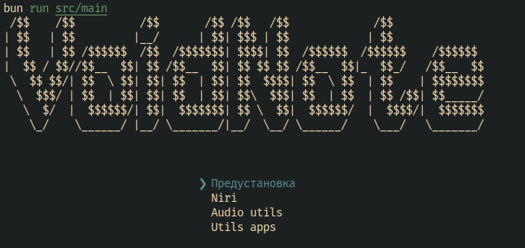

# tui

**Проект находится на ранней реализации!**



To install dependencies:

```bash
bun i
```

To run:

```bash
bun run src/main
```

This project was created using `bun init` in bun v1.3.3. [Bun](https://bun.com) is a fast all-in-one JavaScript runtime.
